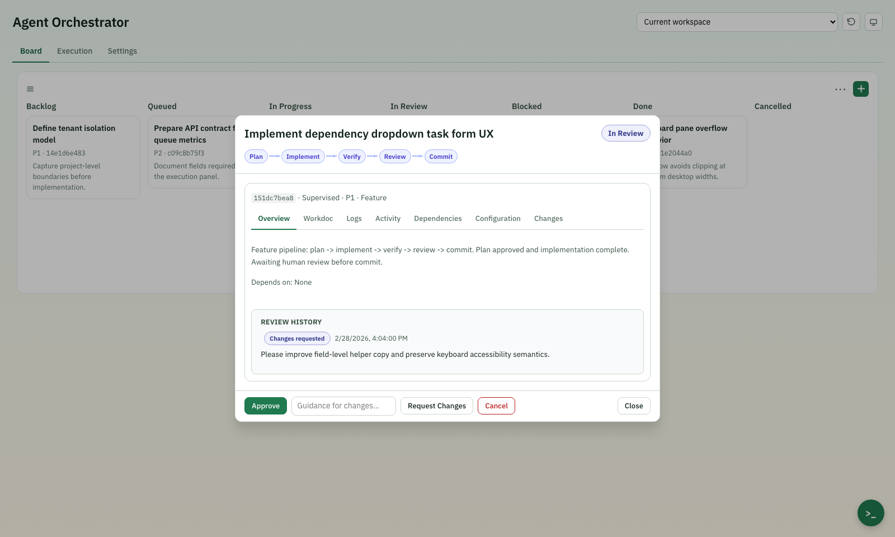

[](https://github.com/Execution-Labs/overdrive/actions/workflows/backend-ci.yml)
[](https://github.com/Execution-Labs/overdrive/actions/workflows/web-ci.yml)
[](https://github.com/Execution-Labs/overdrive/releases)


# Overdrive

Give coding agents real development superpowers.

Instead of one-shot prompting, this system enforces:
plan → implement → verify → review → repeat

The result:
- higher code quality  
- parallel task execution  
- dependency-aware workflows  
- full traceability of every step  

Ship software faster with agents that follow real engineering workflows — not single-shot prompts.

<!-- Regenerate screenshot: npm --prefix web run screenshot:homepage -->



## When to Use Overdrive

When you need:

- Multi-step tasks that need plan → implement → verify → review discipline
- Parallel execution across multiple tasks or repos
- Full audit trail of every agent decision and code change

## What You Can Do

### Deliver high-quality code with intent-specific pipelines
- Write concise, intent-focused prompts.
- Select or let the orchestrator route work through the most suitable built-in pipeline (for example `feature`, `bug_fix`, `refactor`, `hotfix`, `docs`, `test`).
- Each pipeline step applies intent-specific guidance (`plan/analyze`, `implement`, `verify`, `review`, `commit`) to produce higher-quality outcomes than single-pass generation.
- Pipelines iterate review-and-fix loops until findings meet configured tolerance thresholds.
- Full PRDs can be imported and automatically decomposed into dependency-aware execution batches.

### Enforce quality controls
- Choose a Human-in-the-Loop mode per task: **Autopilot**, **Supervised**, or **Review Only**.
  - **Autopilot**: runs end-to-end without approvals.
  - **Supervised**: pauses for your approval before implementation and review before commit.
  - **Review Only**: pauses before commit and adds a final completion gate.
- Configure severity thresholds (`critical`, `high`, `medium`, `low`) globally or per task to control pass/fail tolerance.
- Draft, refine, and commit plan revisions with full lineage before implementation.

### Run tasks in parallel across repositories
- Run independent tasks in parallel, with automatic isolated git worktree provisioning for same-repo execution.
- Automatically integrate branches and trigger conflict-resolution flows when collisions occur.
- Route pipeline steps across providers (Codex, Claude, Ollama) with configurable step-to-provider mapping.
- Use the embedded interactive terminal to intervene manually without leaving the orchestrator UI.

### Review and fix pull requests
- Review GitHub PRs and GitLab MRs: comment, fix, or fix-and-respond to existing review threads.
- Fix modes go beyond comments — they implement fixes, verify, and commit.
- Post-review gate lets you inspect findings and adjust the decision before anything is posted.

### Trace every task
- Track full task history from prompt to completion: task state transitions, plan/workdoc revisions, review decisions, and gate approvals.
- Every task produces a persistent workdoc, plus per-step runtime evidence (`stdout.log`, `stderr.log`, `progress.json`) and event timeline.
- Inspect execution summaries, step outcomes, review findings, total runtime, and commit SHAs in task detail.

## Quick Start

### pip install (recommended)

```bash
pip install overdrive-ai
cd /path/to/your/project
overdrive server                          # UI + API on http://localhost:8080
overdrive server --host 0.0.0.0 --port 9000  # custom host/port
```

### One-liner install

```bash
curl -sSL https://raw.githubusercontent.com/Execution-Labs/overdrive/main/scripts/install.sh | bash
```

### Development setup

```bash
git clone https://github.com/Execution-Labs/overdrive.git
cd overdrive
make setup   # create venv, install backend + frontend
make dev     # start backend on :8080 + frontend on :3000
```

## Navigation

| Tab | Purpose |
|---|---|
| **Board** | Kanban columns with task cards, inline detail/edit, and task explorer |
| **Planning** | Plan creation, iterative refinement, and revision history per task |
| **Execution** | Orchestrator status, queue depth, execution batches, pause/resume/drain/stop controls |
| **Workers** | Provider health (Codex/Claude/Ollama), step-to-provider routing table, active task monitoring |
| **Settings** | Project selector, concurrency, auto-deps, quality gates, worker config, project commands |

## Core Workflows

### Create and run a task

1. Open **Create Work** → **Create Task**.
2. Fill task fields (title, type, priority, description). Use `auto` type when you want the orchestrator to select the best pipeline.
3. Transition to `queued` or run from task detail.
4. Track progress in **Execution**.
5. Review from the task detail modal when it reaches `in_review`.

### Import a PRD into tasks

1. Open **Create Work** → **Import PRD**.
2. Paste PRD content and preview generated tasks/dependencies.
3. Commit the import job.
4. Review and execute created tasks from the board.

### Use embedded terminal

1. Click **Toggle terminal** in the main UI.
2. Start or attach to the active project terminal session.
3. Run commands interactively with live output and ANSI support.
4. Stop the session from the UI when done.

## Task Lifecycle

```
backlog → queued → in_progress → in_review → done
                        ↓               ↓
                     blocked       (request changes → queued)
                        ↓
                    cancelled
```

Tasks support dependency graphs (validated for cycles), automatic dependency inference, parallel execution with configurable concurrency, merge-aware completion for worktree runs, and review cycles with severity-based findings.

## Pipeline Templates

Tasks execute through pipeline templates matched to their type. These templates are designed for code quality and delivery reliability, with specialized step flows by task intent:

| Pipeline | Use case / intent | Steps / flow |
|---|---|---|
| `feature` | Standard feature delivery with planning, quality checks, and commit. | `plan → implement → verify → review → commit` |
| `bug_fix` | Diagnose a bug, fix, verify, and commit. | `diagnose → implement → verify → review → commit` |
| `refactor` | Structured refactor with analysis and explicit plan first. | `analyze → plan → implement → verify → review → commit` |
| `hotfix` | Fast-path production fix without dedicated diagnosis step. | `implement → verify → review → commit` |
| `docs` | Documentation updates with quality verification and review. | `analyze → implement → verify → review → commit` |
| `test` | Add/adjust tests with validation and review before commit. | `analyze → implement → verify → review → commit` |
| `research` | Investigate and produce a report (no commit step). | `analyze → report` |
| `repo_review` | Assess repository state, form an initiative plan, then generate execution tasks. | `analyze → initiative_plan → generate_tasks` |
| `security_audit` | Scan dependencies/code for security issues, report, and emit remediation tasks. | `scan_deps → scan_code → report → generate_tasks` |
| `review` | Analyze and review existing changes, then produce a report. | `analyze → review → report` |
| `performance` | Profile baseline, optimize, benchmark, then review and commit. | `profile → plan → implement → benchmark → review → commit` |
| `spike` | Timeboxed exploratory prototype and recommendation report. | `analyze → prototype → report` |
| `chore` | Mechanical maintenance work with verification and commit. | `implement → verify → commit` |
| `plan_only` | Initiative-level planning and decomposition into executable tasks. | `analyze → initiative_plan → generate_tasks` |
| `verify_only` | Run checks and report status without making code changes. | `verify → report` |
| `commit_review` | Review an existing commit, then fix, verify, and commit. | `commit_review → implement → verify → review → commit` |

## API and CLI

- REST/WebSocket reference: `docs/API_REFERENCE.md`
- CLI reference: `docs/CLI_REFERENCE.md`
- End-to-end usage guide: `docs/USER_GUIDE.md`

API base path: `/api`
WebSocket endpoint: `/ws`

### CLI quick reference

```bash
# Start server
overdrive server --project-dir /path/to/repo

# Task management
overdrive task create "My task" --priority P1 --task-type feature
overdrive task list --status queued
overdrive task run <task_id>

# Orchestrator control
overdrive orchestrator status
overdrive orchestrator control pause

# Project management
overdrive project pin /path/to/repo
overdrive project list
overdrive project unpin <project_id>
```

## Configuration and Runtime Data

Runtime state is stored in the selected project directory:
- `.overdrive/runtime.db` (canonical runtime state store)
- `.overdrive/workdocs/<task_id>.md` (canonical task workdocs synced with per-worktree `.workdoc.md`)
- `.overdrive_archive/state_<timestamp>/` (archived runtime snapshots on clear)

Execution metadata also records per-step log artifact locations (for example `stdout.log`, `stderr.log`, and `progress.json`) in task run details.

Primary configurable areas:
- `orchestrator` (concurrency, auto deps, review attempts)
- `agent_routing` (default role, task-type role routing, provider overrides)
- `defaults.quality_gate`
- `workers` (default provider, routing, providers)
- `project.commands` (per-language test, lint, typecheck, format commands)
- `project.prompt_injections` (per-step additive prompt text appended to worker instructions)

Claude provider example:
```json
{
  "workers": {
    "default": "claude",
    "providers": {
      "claude": {
        "type": "claude",
        "command": "claude -p",
        "model": "sonnet",
        "reasoning_effort": "medium"
      }
    }
  }
}
```

Notes:
- Claude CLI must be installed and authenticated locally.
- Reasoning effort flags are only passed when supported by your installed CLI version.

## Verify Locally

```bash
# Use Python 3.10+ and a local virtualenv
python3 -m venv .venv
.venv/bin/pip install -e ".[test,dev]"

# Backend tests
.venv/bin/pytest -q

# Optional integration tests (skipped by default and in CI)
OVERDRIVE_RUN_INTEGRATION=1 .venv/bin/pytest tests/test_integration_worker_model_fallback.py
OVERDRIVE_RUN_INTEGRATION=1 .venv/bin/pytest tests/test_integration_claude_provider.py

# Frontend checks
npm --prefix web run check

# Frontend smoke e2e
npm --prefix web run e2e:smoke
```

Local pushes are gated by `.githooks/pre-push` and run:
- `.venv/bin/ruff check .`
- `.venv/bin/pytest -n auto -q`
- `npm --prefix web run check`

Enable hooks once per clone:
```bash
git config core.hooksPath .githooks
```

## Documentation

- `docs/README.md`: documentation index
- `docs/USER_GUIDE.md`: complete user guide
- `docs/API_REFERENCE.md`: endpoint and WebSocket reference
- `docs/CLI_REFERENCE.md`: CLI commands and options
- `web/README.md`: frontend-specific setup and test workflow
- `example/README.md`: sample project walkthrough

## Versioning

Overdrive follows Semantic Versioning.

During `v0.x`, the primary compatibility surface is the CLI and configuration schema. The REST/WebSocket API and UI are evolving and may change between minor releases.

## License

Released under the MIT License.
